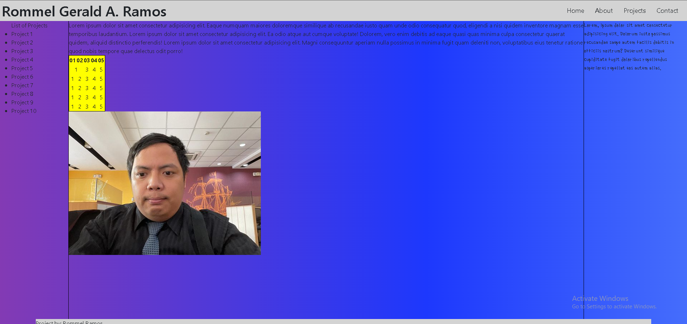
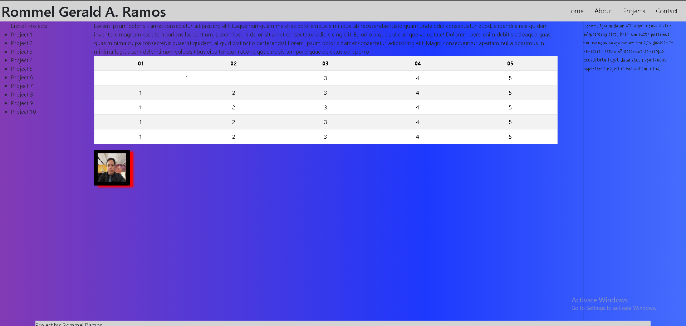
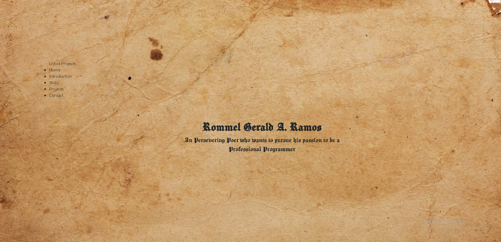
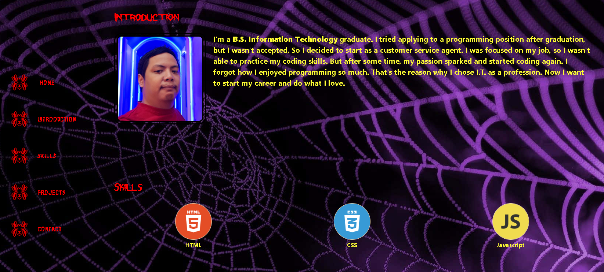

# Week 1

## March 21:

1. learned about tables
2. started studying CSS
3. experimented on how grids work

## March 22:

1. learned about tables
2. how to do colspan
3. learned gradiant backgrounds
4. put comment segments in codes

## March 23:

1. Started making this my (experimental) portfolio
2. started doing bootstrap
3. preparing the navigation buttons
4. making this documentation

## March 24:

1. Decided for an old timey design
2. Put new background
3. Re-adjusted the grid layout
4. started putting info
5. learned how to put grid within the grid
6. uploaded this to github

# Week 2

## March 27

1. Decided on a "Web" developer theme
2. Changed the background, and font
3. added the other sections
4. edited the left nav

## March 28

1. made some adjustments on the Skills section
2. Changed font color to make it easier to understand
3. Started working on projects

